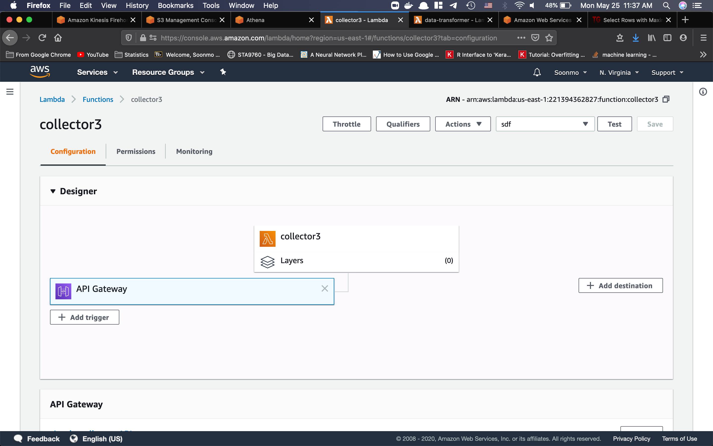
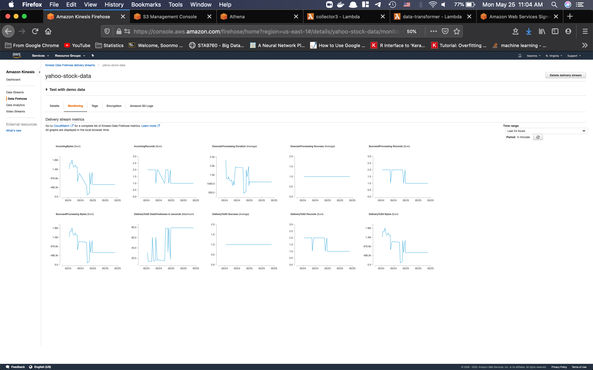

# Streaming Yahoo Finance Stock data in AWS

In this project, several AWS services are inplemented such as AWS S3, Kinesis, Athen, Glue, and Lambda function.

The purpose is to stream yahoo finance stock data of 10 companies to AWS S3 and query in AWS Athena. Lambda function in AWS has a major role in collecting data from Yahoo Finance and storing it to S3.

After I encountered several errors when coding in lambda fucntion, I decided to apply Deployment Package using docker. I can achieve intalling Python dependencies in lambda function by uploading the deployment package, which is a zip file. Deployment Package is [here](lambda.zip).

Data collector lambda fuction url is [https://sdx5x1k8od.execute-api.us-east-1.amazonaws.com/default/collector3]( https://sdx5x1k8od.execute-api.us-east-1.amazonaws.com/default/collector3) and datacollector source code is also in the deployment pacakge. The source code transforms the dataframe from yfiance module to json format. In order to connect to AWS Kinesis Firehose, boto3.client is used.

Lambda function configuration for data collector is below.

Kinesis Firehose monitoring page screenshot is below.

For the analysis, hourly high stock price is extracted for the companies. The file is [here](results.csv). Analysis using this hourly high stock price dataset is [here](Analysis.ipynb).

